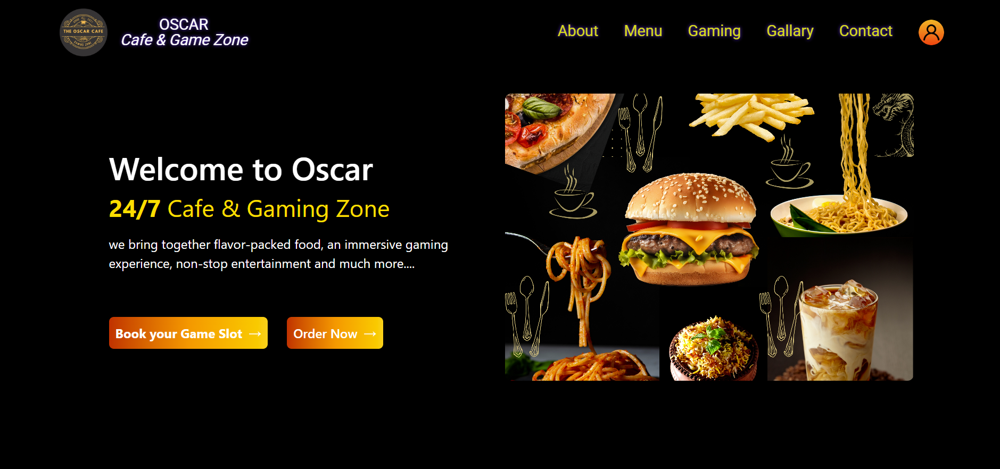
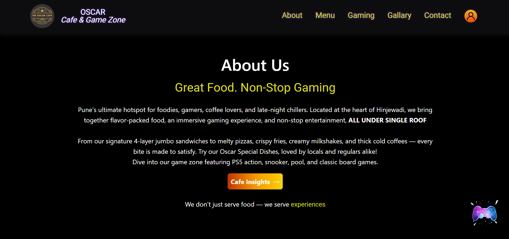
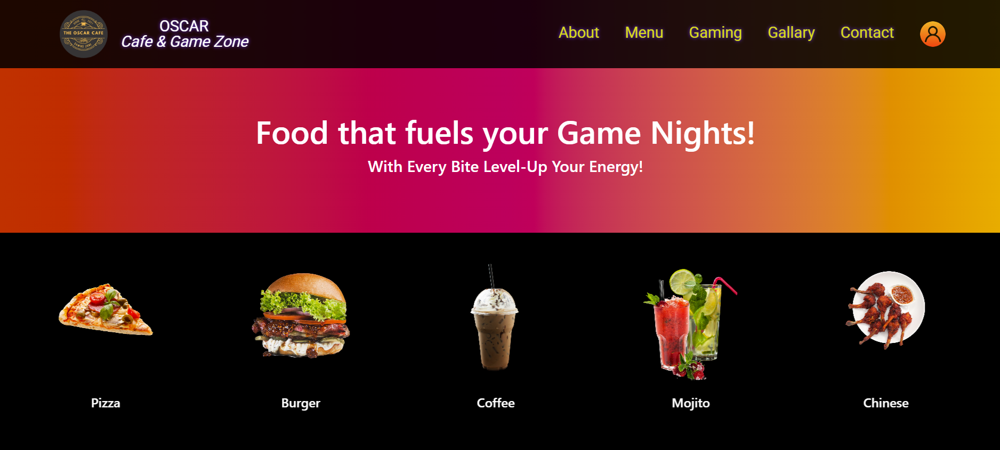
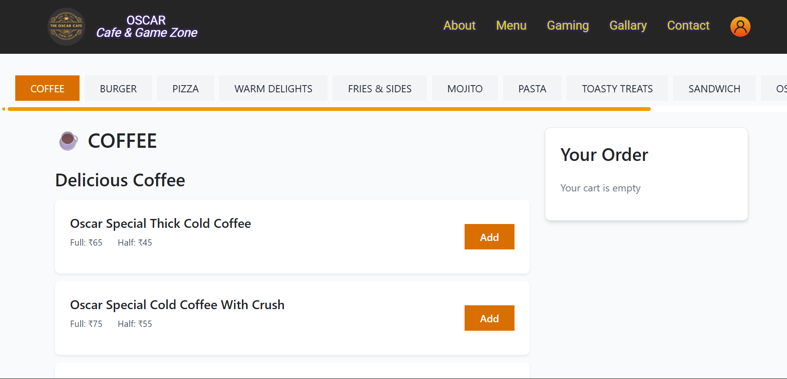

# Cafe-Gaming Zone Website

An interactive website designed to give an online presence to a Cafe with a unique Gaming Zone twist. It serves two primary purposes:
- Allowing customers to order food online.
- Engaging customers with updates, offers, and (in future updates) allowing them to book game and pool table slots.

## 🧾 Project Overview

This is a **React-based web application** built to showcase a café’s offerings, allow online food orders, and eventually provide a platform to book gaming slots and other activities. The goal is to stay connected and engaged with customers, promote active deals, and enable a smooth online interaction for the café.

### 🌟 Core Features (Current)

- ✅ Home Page with a themed UI for Cafe + Gaming
- ✅ Food ordering section
- ✅ Firebase Authentication (Login/Signup)
- ✅ Responsive design using TailwindCSS
- ✅ Promotional UI elements and engaging content sections

### 🔜 Upcoming Features

- 🎮 Book a Game Slot (Under Development)
- 🎱 Pool Table Booking functionality
- 🗓 Dashboard for managing bookings & orders

## 🛠️ Tech Stack

- **Frontend:** React, TailwindCSS, HTML, CSS
- **Backend Services:** Firebase (Authentication currently, Realtime DB/Firestore integration planned)
- **Other Tools:** React Router, Firebase Hosting (optional)

## 🚀 Getting Started

To run this project locally:

1. **Clone the repository:**
   ```bash
   git clone https://github.com/28Avantika/OscarCafeWebsite.git

## 📸 Screenshots

### Home Page


### About Page


### Menu Landing Page


### Order Online View
 
